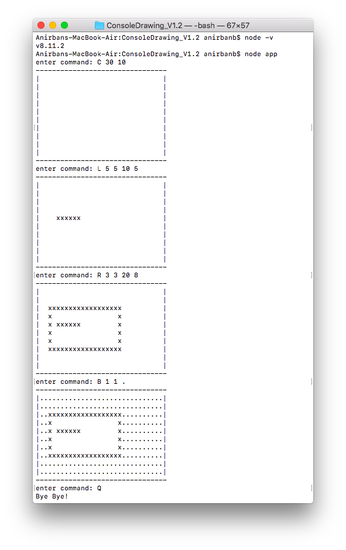

# Console Drawing App

A simple console drawing app built with Javascript. In Console Drawing App, users can :

* Create a new canvas
* Start drawing on the canvas by issuing various commands
* Quit

Following commands are supported now ~
* To Create Canvas
```command line
    C <width> <height>
```
* To Draw a Line
```command line
    L <x1> <y1> <x2> <y2>
```
* To Draw a Rectangle
```command line
    R <x1> <y1> <x2> <y2>
```
* To Fill the Area With Color
```command line
    B <x> <y> <color>
```
* Quit
```command line
    Q
```

## Assumptions

* The origin (0,0) is top left of the canvas.
* X coordinate increases by value one on right direction from the origin.
* Y coordinate increases by value one on down direction from the origin.
* The line is drawn using left point (x1,y1) and right point (x2,y2). Only straight lines are supported for now.
* The rectangle is drawn using upper left corner (x1,y1) and
lower right corner (x2,y2).

## Prerequisites & Setup

* You need to have [Node](https://nodejs.org) installed in your system.
* No third party libraies have been used thus package.json is not included.

## Run

* Open command line (Windows) or terminal (Mac) Navigate to the root directory of the project.
* Run the following

```command line
node app
```
Example Run


## Areas of improvement

* Error Handling
* Unit tests
* Adding more shapes
* Converting to ES6
* Minification and Bundling

## Project Structure

```
|_app.js
|_canvas.js
|_queue.js
```
`app.js` is the starting point of the application. Reading input from user and possible error scenarios are handled here.

`canvas.js` has all canvas related APIs. It contains an ES5 constructor function which is invoked in `app.js` to create an object of the canvas.

`queue.js` contains a javascript implementation of the Queue data structure. Which is used to store the nodes in `canvas.fill` API.

## Development

I have used ES5 to develop this application. However it can be migrated to ES6 with very little effort. I chose not to use ES6 because it might require additional setup for transpilation. For the interest of time I focused less on setup, more on solving the actual problem.

The code is modulerized with CommonJs pattern. As we are using node and node supports CommonJS by default. 

The fill API is implemented using the [Flood Fill](https://en.wikipedia.org/wiki/Flood_fill#Alternative_implementations) algorithm <Wiki Link>. I have used The BFS approach to traverse a graph. Queue data structure is used to implement it.


## Thank You